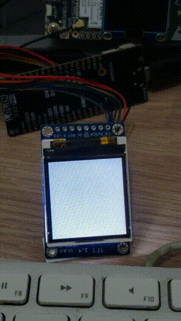
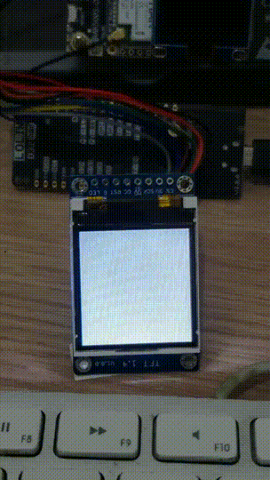

# MicroPython-ST7735

This is a modified version of [GuyCarver's ST7735.py](https://github.com/GuyCarver/MicroPython/blob/master/lib/ST7735.py) ST7735 TFT LCD driver for MicroPython.

This version is for micropython-esp32. The original github is [here](https://github.com/boochow/MicroPython-ST7735/blob/master/ST7735.py).

A font file is necessary for displaying text (some font files are in [GuyCarver's repo](https://github.com/GuyCarver/MicroPython/tree/master/lib)).

Text nowrap option added (default: nowrap=False).

Pin connections:

LCD |ESP32-DevKitC
----|----
VLED|3V3
RST |IO17
A0  |IO16(DC)
SDA |IO13(MOSI)
SCK |IO14(CLK)
VCC |3V3
CS  |IO18
GND |GND

`tftbmp.py` is another sample similar to [Adafruit's tftbmp sketch for Arduino](https://github.com/adafruit/Adafruit-ST7735-Library/blob/master/examples/spitftbitmap/spitftbitmap.ino). IT IS VERY SLOW. I modified it to save the 2-byte 565 RGB stream to a file, with the .b16 suffix. Once you have that, you can run instead `fastbmp.py`, which is very fast. Change the filename in the code appropriately.

I use Thonny to code and place `.bmp` files in the device.

VS

